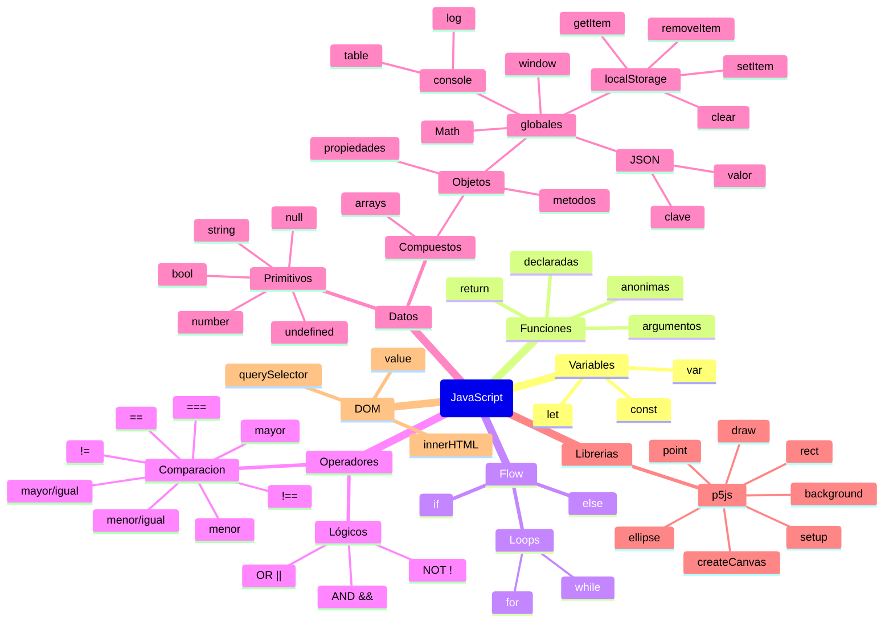

```mermaid
mindmap
  root(JavaScript)
    Variables
      var
      let
      const
    Funciones
      declaradas
      anonimas
      return
      argumentos
    Flow
      if
      else
      Loops
        while
        for
    Operadores
      Lógicos
        OR ||
        AND &&
        NOT !
      Comparacion
        ==
        ===
        !=
        !==
        mayor
        menor
        mayor/igual
        menor/igual
    Datos
      Primitivos
        string
        number
        bool
        undefined
        null
      Compuestos
        arrays
        Objetos
          globales
            Math
            console
              log
              table
            window
            localStorage
              setItem
              getItem
              clear
              removeItem
            JSON
              clave
              valor
          propiedades
          metodos
    Librerias
      p5js
        setup
        draw
        createCanvas
        background
        ellipse
        point
        rect
    DOM
      querySelector
      innerHTML
      value
```